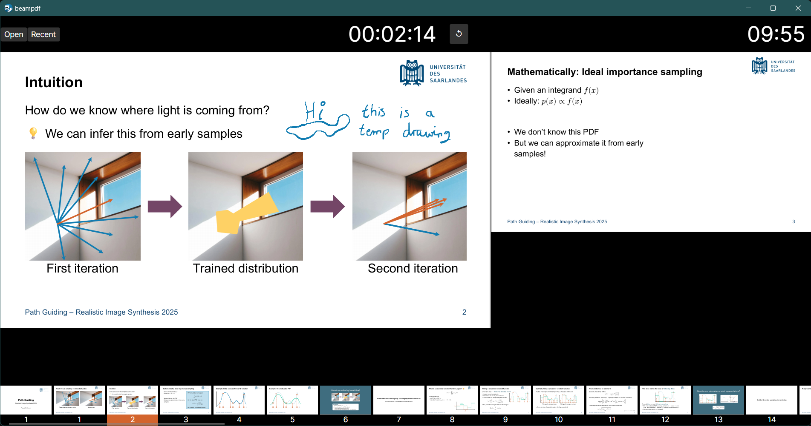
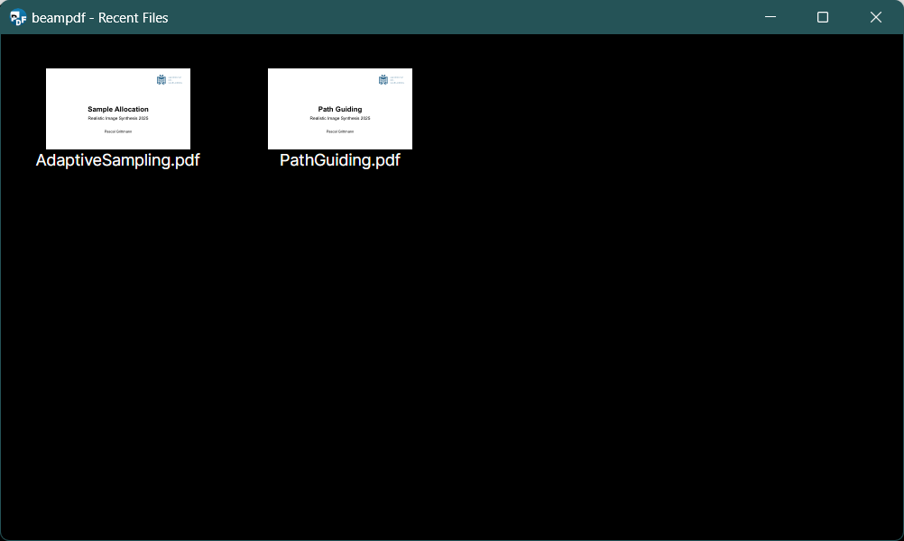

# beampdf

A simple cross-platform app to present a PDF slideshow. Based on [Avalonia](https://github.com/AvaloniaUI/Avalonia) and [MuPDF.NET](https://github.com/ArtifexSoftware/MuPDF.NET).

## Features

- Presenter view
  - Displays current slide and previews the next one
  - Timer (starts automatically on first slide switch, start or reset manually with `S`) and current system time in 24h format
- Navigate slides
  - Slide number based on PDF page labels; pages with same label are assumed to be part of a single animated slide
  - Forward and backwards via arrow keys
  - Type number and hit `Enter` to jump
  - Clickable slide-thumbnails with current slide highlighted
- Fullscreen slide view
  - In a separate window
  - Open with `F5` close with `ESC`
  - Keyboard shortcuts (`Shift + N` to move to the n-th screen)
- Simple drawing tool
  - Sketch temporary drawings on the slide
  - Resets on slide navigation or via `Backspace`
  - Supports pen pressure
- Magnifier
  - Select a crop via right-click and drag or `Ctrl+` left-click and drag
  - Reset via right-click or `Ctrl+left`
- Recent files (open dialog with `R`)
  - List of opened files is tracked in a `.csv` file in the `ApplicationData` folder (as reported by `Environment.SpecialFolder.ApplicationData`)
- Speaker notes
  - As embedded files in the PDF
    - filename must be `XX-speaker-note` where XX is the slide number (page label, not "real" page)
    - content is interpreted as UTF-8 string
  - As annotations: annotations in the PDF are rendered into the presenter view only
- Video via [libVLCSharp](https://code.videolan.org/videolan/LibVLCSharp)
  - Embedded files in in the PDF with special filename provide video playback hints:
    - `XX-video-FILENAME` where XX is the slide number and `FILENAME` the relative path from the `.pdf` to the video
    - the file description must be `X,Y,W` where `X` and `Y` are the top left corner and `W` the width of the video in the `.pdf` (in points)
  - Playback starts automatically in the fullscreen display when the slide is opened
  - `libVLC` is an optional dependency; without it, PDFs that don't contain video can still be presented

## Screenshots
### The presenter view in action


### Recent files dialog for quick PDF switching


## Using beampdf

Currently, no binaries are provided. Only tested on Windows and Linux, but should run on any platform supported by Avalonia and MuPDF.NET.

To run from source, install the [.NET SDK](https://dotnet.microsoft.com/en-us/download) and run
```
dotnet run -c Release
```

To build deployable binaries
```
dotnet publish -c Release
```

For video support on Linux, install libvlc. Something like
```sh
# Debian / Ubuntu / etc
sudo apt install vlc libvlc-dev
# Fedora etc
sudo dnf install vlc vlc-devel
```
(see https://github.com/videolan/libvlcsharp/blob/3.x/docs/linux-setup.md)
Without libVLC, if you open a PDF with a video, beampdf will crash when trying to play it currently.

### Preventing the screen from turning off
On Windows, the screen is kept awake while the DisplayWindow is open (via WinAPI). On Linux, similar behavior can be achieved by running via
```sh
systemd-inhibit beampdf
```

## Typst support for video and notes

Here are the utility functions that I use to output speaker notes and video links in [Typst](https://github.com/typst/typst)

```
#let speaker-note(text) = only(1, context {
    let page-idx = counter(page).get().at(0)
    let lbl = str(page-idx) + "-speaker-note"
    pdf.embed(
      lbl,
      bytes(text),
      description: lbl,
      mime-type: "text/plain"
    )
  })

#let video(static, filename, width: 100%, ..args) = block(layout(imgsize => {
  // Track the image placement info as an embedded file
  let pos = here().position()
  let page-idx = counter(page).get().at(0)
  let lbl = str(page-idx) + "-video-" + filename
  pdf.embed(
    lbl, // We _could_ embed the acutal video here, too. But nicer for sharing slides if we don't.
    bytes(lbl),
    description: str(pos.x.pt()) + "," + str(pos.y.pt()) + "," + str(imgsize.width.pt()),
    mime-type: "text/plain"
  )
  // Display static preview and the filename of the video for manual playback in handouts
  image(static, ..args)
  place(dy: -1.5em - 8pt, dx: 1em, box(link(filename, filename), fill: white, inset: 8pt))
}), width: width)
```
